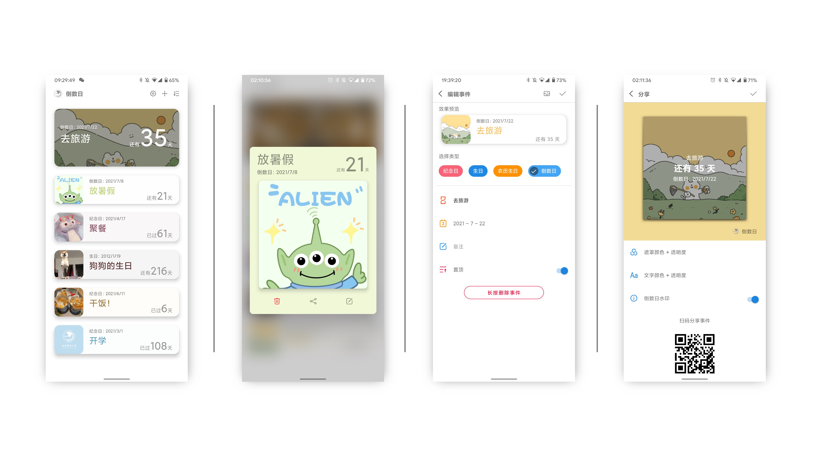
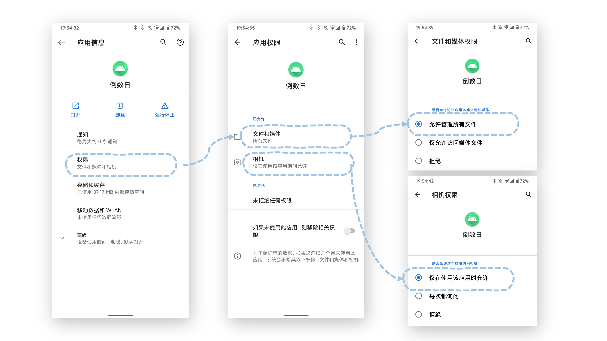
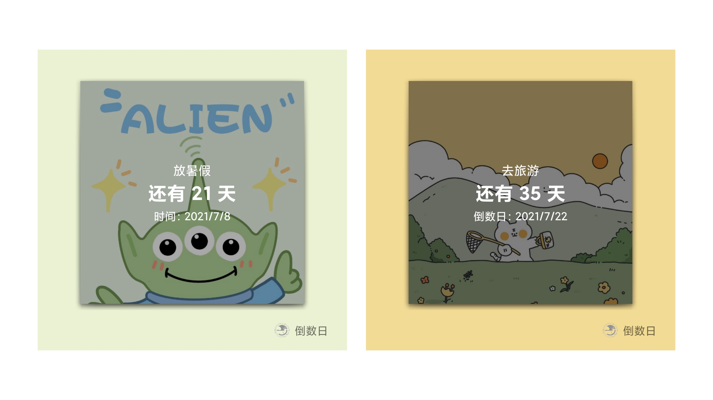

# BUPT Countdown



北京邮电大学软件工程系2018级Android开发课期末大作业

王衔飞 陈昱滔 张石一 李林 谢凯 侯润宁 

### 下载APK

见[Release页面](https://github.com/xianfei/bupt_countdown/releases)

### 特色

🌟 自动取色算法 从图片中自动进行配色（灵感来自于Material You）

🌟 支持面对面分享（通过扫描二维码）

🌟 支持通过URL从服务器获取一个或多个事件

🌟 支持生日、农历生日

### TODO

使用原生Material You配色（等Google官方开发文档出了）

### BUGs

1. 经测试，在Android 11原生系统上小部件不可用，但在MIUI 12.5（Android 11 based）中可用。

2. 扫描二维码不会自动申请摄像头权限，备份不会自动申请完全磁盘访问权限，需在设置中手动申请

   

3. 置顶事件背景对比度不稳定，自动取色看起来有时候也不太稳定，大部分时候还好。

### 关于从URL导入事件

格式为::分隔符的七元组，分别为：

```事件名::类型::年::月::日::备注::图片URL```

如：```test::0::2021::5::16::::```

### 关于分享

分享页面右上角的勾（√）为保存图片到相册。导出图片如图：

